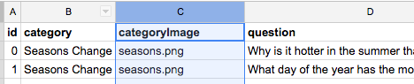

# Add Category Button Images
**!! Dependency: idewTrivia 1.2 or higher**

If you want to add images to your category buttons, like the button below, follow these steps. 



### Add Images to Code Folder and Image Names to Spreadsheet

*  First place images in your code folder that you want to use. 
* Then update your question bank spreadsheet by inserting a column labeled ```categoryImage```.  
* For each question place the name of the category image in the newly created column. 
* Remember to transform your spreadsheet into a JavaScript object for your ```questions.js``` file.  







### Changes to index.html

* Add an image element to your ```index.html```.







### Changes to style.css

* Add some appropriate dimensions and style to the ```categoryImage``` class.


```css
.categoryImage {
    margin: 10px;
    width: 150px;
}```


With these changes you should see your images displaying on the category buttons. Refine and style as you wish.
