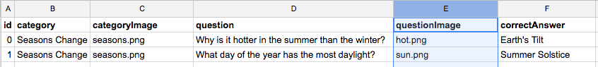

# Add Specific Question Images to Question Screens
**!! Dependency: idewTrivia 1.2 or higher**

Instructions to add specific question images above each question, like below. 



### Add Images to Code Folder and Image Names to Spreadsheet

* First place images in your code folder that you want to use. Then update your question bank spreadsheet by inserting a column labeled ```questionImage```.  
* For each question place the name of the question image in the newly created column. 
* Remember to transform your spreadsheet into a JavaScript object for your ```questions.js``` file. 






### HTML

* Add an `````` element in your html with a unique *id*. 


Add the highlight HTML.




### CSS

* You will likely want to add a style to set the width of your image. 


```
#question-image {
    width: 90px;
}```




### JS Code

* Once you have category image file names in your question bank, the variable ```trivia.categoryImage``` contains the image file name for the current question's category. 


Add the highlight JS code to your ```gotoQuestionScreen()``` function.



